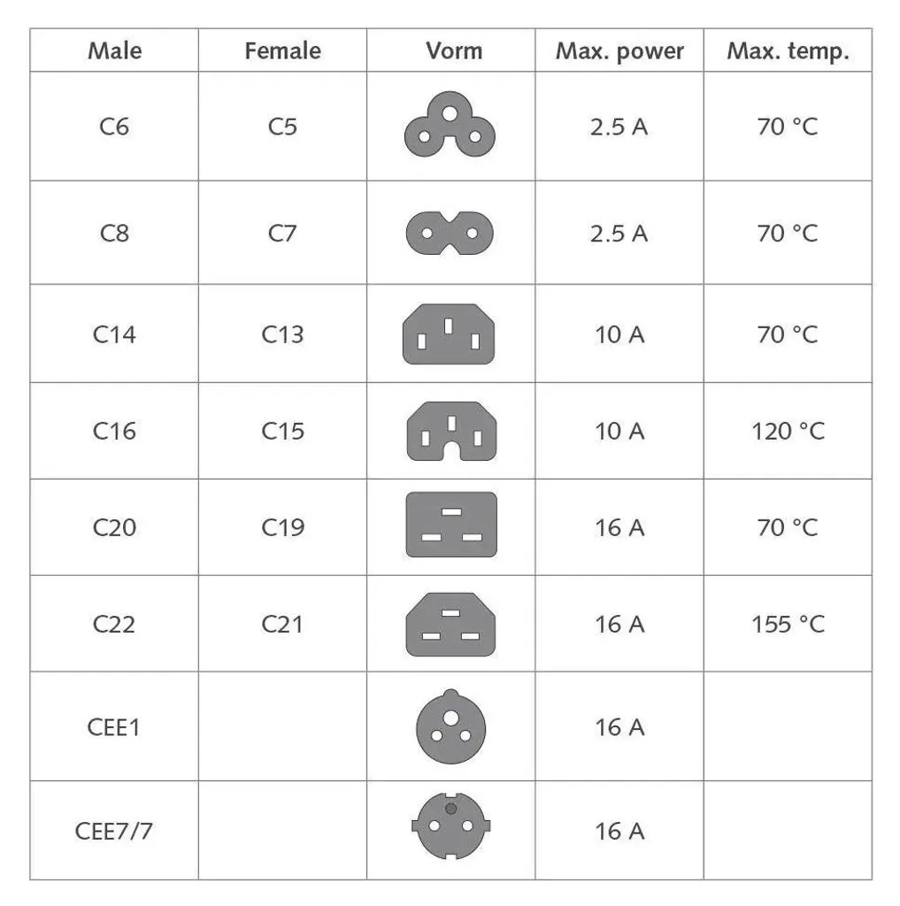

# Electrical Wiring in Italy

The Italian standards body is the [Comitato Elettrotecnico Italiano (CEI)](https://www.ceinorme.it/).

Italy uses a nominal 230 V, 50 Hz mains supply. [[1]](#source-1)
[CEI 23-50](https://mycatalogo.ceinorme.it/cei/item/000003542?sso=y) is the Italian standard covering plugs and socket-outlets for
household and similar uses; it replaced the older CEI 23-16 standard.
[[2]](#source-2)

## Sockets and Plugs

### Type C Europlug

The [Europlug](https://en.wikipedia.org/wiki/Europlug) is a two-pin, unearthed
plug rated at 2.5 A and 250 V AC. It is intended for low-power,
double-insulated equipment that does not require a protective-earth connection.
Its flexible pins allow it to fit several socket systems used across continental
Europe, including compatible Italian sockets. [[4]](#source-4)

### Type F socket

Type F is commonly called [Schuko](https://en.wikipedia.org/wiki/Schuko), from
the German word _Schutzkontakt_. It is a recessed, earthed system rated up to
16 A, with protective-earth contacts on the sides. In Italy it is often found
in combined sockets that also accept Type L plugs. [[4]](#source-4)

### Type L variants

Type L is the traditional Italian plug and socket. It has three aligned pins
and comes in 10 A and 16 A variants.

| Variant | Pin diameter | Pin spacing | Typical use |
| --- | ---: | ---: | --- |
| 10 A | 4 mm | 9.5 mm | Lighting and small appliances |
| 16 A | 5 mm | 13 mm | Larger appliances |

Both Type L variants are unpolarized, so the plug can be inserted in either
orientation. The two variants are not interchangeable unless the socket is
designed to accept both.

## Appliance Couplers

The C-numbered connectors in the chart below are primarily IEC 60320 appliance
couplers—the detachable connections on equipment such as computers and
appliances—not Italian wall-socket types. [[3]](#source-3)

## Light Switches

Fixed household light switches are covered by
[CEI EN 60669-1](https://mycatalogo.ceinorme.it/cei/item/0000016329?sso=y), while
CEI 23-50 covers plugs and socket-outlets. [[5]](#source-5)

Italian wiring accessories are commonly sold as modular product families. The
switch mechanism, mounting support, cover plate, box size, and any connected
gateway must be selected as a compatible system; similar-looking parts from
different families should not be assumed to fit.

Brands: [BTicino](https://www.bticino.it/privati),
[Vimar](https://www.vimar.com/en/int/), and
[VDA Telkonet](https://vdatelkonet.com/). Futina also sells
[Italian-format product families](https://www.futinaswitch.com/italian-switches-and-sockets/).

As of September 6, 2026, the prices below are examples for a basic switch
mechanism, not complete installed points. Public prices include or exclude VAT
as noted by the seller. [[6]](#source-6) [[7]](#source-7) [[8]](#source-8)
[[9]](#source-9)

| Product family and official information | Best fit | CONs | Example component price |
| --- | --- | --- | ---: |
| [Futina Lively series](https://www.futinaswitch.com/products/switches-and-sockets-italian-lively-series/) ([catalog](electrical/FUTINA-lively.pdf)) | Budget-conscious projects where the exact local certification and compatible components can be confirmed | No public Italian retail price; local certification, availability, and component compatibility need confirmation | [Quote required](https://www.futinaswitch.com/products/smart-switches-and-socket-italian-type/) |
| [BSEED smart switches](https://www.bseed.com/it/collections/interruttore-luce/1-gang) | Design-led residential retrofits needing touch, Wi-Fi, Zigbee, or Matter options | Product dimensions and back-box fit vary; many smart models require a neutral wire and use the Tuya or Smart Life ecosystem | [From €18.94](https://www.bseed.com/it/collections/interruttore-luce/1-gang) |
| [BTicino Living Now](https://www.bticino.it/gamma-interruttori-placche/living-now) ([2026 catalog](electrical/BTicino-living-now-2026.pdf)) | [Residential projects](https://www.leroymerlin.it/prodotti/elettricita-automazioni-e-fotovoltaico/placche-e-interruttori/serie-bticino/) needing traditional or connected controls in one coordinated design | Connected functions require compatible devices and a gateway; covers, supports, and plates are separate components | [€11.57](https://catalogo.bticino.it/prodotto/soluzioni-per-edifici-residenziali-e-nel-terziario/living-now/comandi-principali/BTI-K4001-IT) |
| [Vimar Idea](https://www.vimar.com/en/int/a-new-smart-idea-is-born-15813132.html) | Existing Idea [installations or residential retrofits](https://www.leroymerlin.it/prodotti/elettricita-automazioni-e-fotovoltaico/placche-e-interruttori/serie-vimar/serie-vimar-idea/) that may add connected controls | A connected retrofit requires compatible powered devices; supports and plates must match the Idea family | [€7.47 listed](https://www.eurekashop.it/shop/categoria-prodotto/elettricita/serie-civili/vimar-idea/) |
| [Vimar Plana Up](https://www.vimar.com/en/int/plana-up-natural-evolution-of-plana-19008122.html) ([catalog](electrical/vimar-plana-up-en.pdf)) | [Residential or hospitality projects](https://www.leroymerlin.it/prodotti/elettricita-automazioni-e-fotovoltaico/placche-e-interruttori/serie-vimar/serie-vimar-plana-up/) needing a broad modular range, connected controls, or [KNX](https://www.knx.org/explore-knx/what-is-knx) integration | Connected or KNX functions require additional system components and specialist configuration | [€3.49 listed](https://www.tecnomat.it/it/c/elettricita-e-fotovoltaico/placche-interruttori-e-prese/serie-vimar/vimar-plana/) |
| [VDA Telkonet Axia](https://vdatelkonet.com/axia/) | Premium hospitality projects using a guest-room management system | Hospitality-focused, quote-only product that depends on project-specific integration and commissioning | [Quote required](https://vdatelkonet.com/axia/) |

Do not compare mechanism-only prices with complete installed points. A usable
point may also require a support, cover plate, box, gateway, actuator, or
specialist commissioning. Have a qualified electrician confirm electrical and
mechanical compatibility before purchase.

## Source References

1. [European Commission: external power supplies and 230 V mains voltage](https://energy-efficient-products.ec.europa.eu/product-list/external-power-supplies_en)
2. [CEI 23-50: plugs and socket-outlets for household and similar purposes](https://mycatalogo.ceinorme.it/cei/item/000003542?sso=y)
3. [IEC 60320-1:2021: appliance couplers for household and similar purposes](https://webstore.iec.ch/en/publication/64901)
4. [European Commission: plugs and sockets in Europe](https://commission.europa.eu/system/files/2017-09/xii24a_plugs_and_sockets.pdf)
5. [CEI EN 60669-1:2018: switches for household and similar fixed electrical installations](https://mycatalogo.ceinorme.it/cei/item/0000016329?sso=y)
6. [BTicino catalog: Living Now K4001 switch price](https://catalogo.bticino.it/prodotto/soluzioni-per-edifici-residenziali-e-nel-terziario/living-now/comandi-principali/BTI-K4001-IT)
7. [Tecnomat: Vimar Plana and Plana Up component prices](https://www.tecnomat.it/it/c/elettricita-e-fotovoltaico/placche-interruttori-e-prese/serie-vimar/vimar-plana/)
8. [EurekaShop: Vimar Idea component prices](https://www.eurekashop.it/shop/categoria-prodotto/elettricita/serie-civili/vimar-idea/)
9. [BSEED Italy: one-gang light-switch products and prices](https://www.bseed.com/it/collections/interruttore-luce/1-gang)
